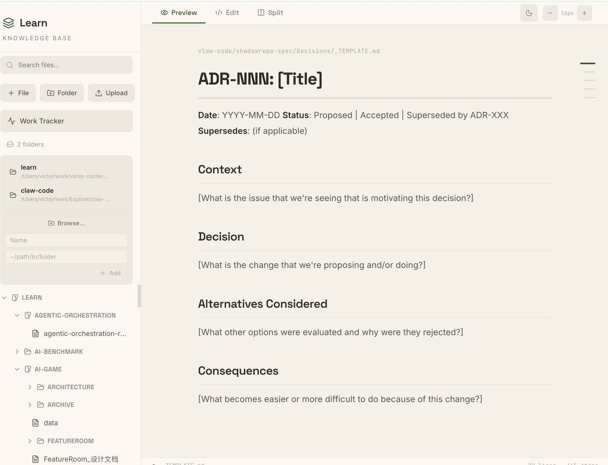
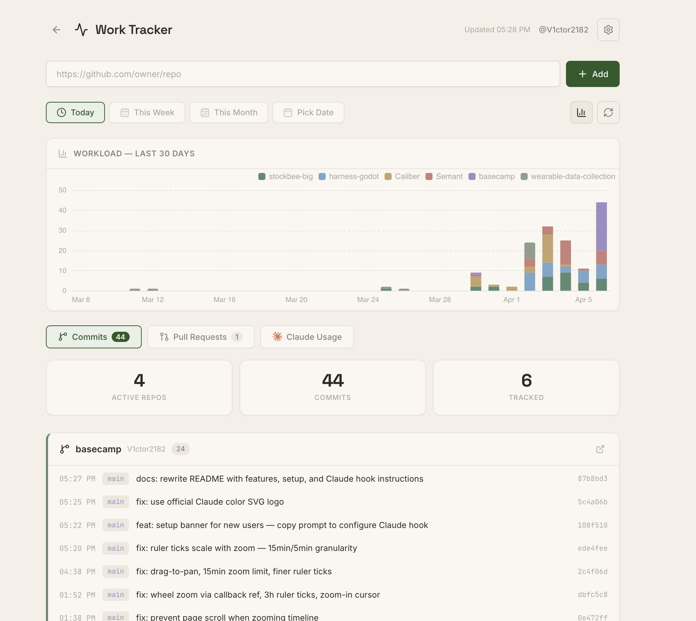
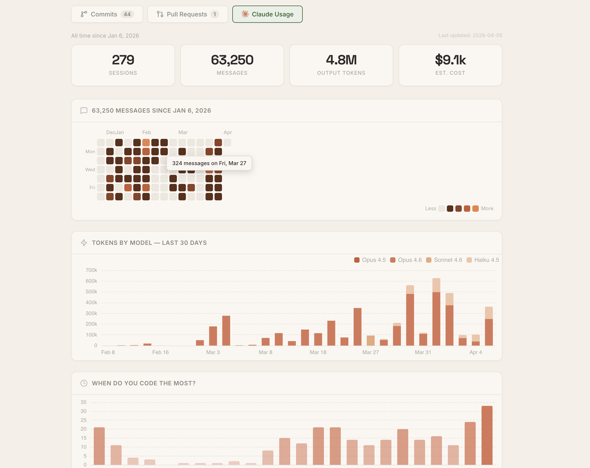

# Learn Dashboard

A local-first knowledge base viewer + work tracker with Claude Code usage analytics.

## Features

### Knowledge Base

Markdown viewer/editor with live preview, Mermaid diagrams, CodeMirror, multi-directory support, and an interactive widget system.



### Work Tracker

GitHub activity monitoring — commits and PRs across tracked repos with workload charts, date range views, and calendar picker.



### Claude Code Usage

Stats overview, contribution heatmap, token usage by model, activity timeline (day/week/month/projects), and model cost breakdown — powered by [ccusage](https://github.com/ryoppippi/ccusage) (auto-installed with `npm install`) and Claude Code session logs (`~/.claude/projects/`).



## Setup

```bash
npm install
npm run dev
```

Runs on `localhost:5173` (frontend) + `localhost:8000` (API).

> **Note:** Token and cost data requires [ccusage](https://github.com/ryoppippi/ccusage), which is included as a dependency and installed automatically via `npm install`. Activity data (messages, sessions, tool calls) is read directly from `~/.claude/projects/` session logs.

### Claude Code Activity Tracking (optional)

The Activity Timeline requires a Claude Code hook to record when you use Claude. Click **"Copy Setup Prompt"** in the Claude Usage tab and paste it into Claude Code, or manually add this to `~/.claude/settings.json`:

```json
{
  "hooks": {
    "Stop": [
      {
        "hooks": [
          {
            "type": "command",
            "command": "bash -c 'INPUT=$(cat); curl -s -X POST http://localhost:8000/api/claude-ping -H \"Content-Type: application/json\" -d \"$INPUT\" --max-time 3 >/dev/null 2>&1 || true'",
            "timeout": 5
          }
        ]
      }
    ]
  }
}
```

This hook fires on every Claude response (globally, all projects) and records timestamp, session ID, and project name. Fails silently if the dashboard server isn't running.

## Data Storage

All data is local JSON files in `data/`:

| File | Contents |
|---|---|
| `claude-pings.json` | Activity pings `[{ ts, session, project }]` |
| `repos.json` | Tracked GitHub repositories |
| `config.json` | GitHub username + token |
| `learn-dirs.json` | Knowledge base directory paths |

Claude activity is read from `~/.claude/projects/` session logs. Token/cost data comes from `ccusage`.

## Tech Stack

React 19 · Vite · TypeScript · Express · ECharts · CodeMirror · react-markdown
